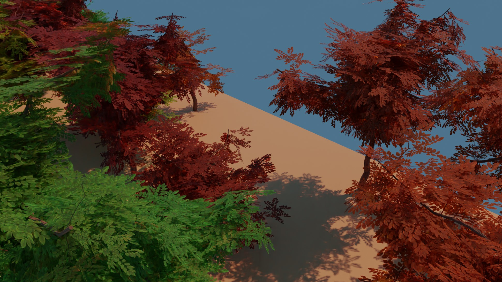
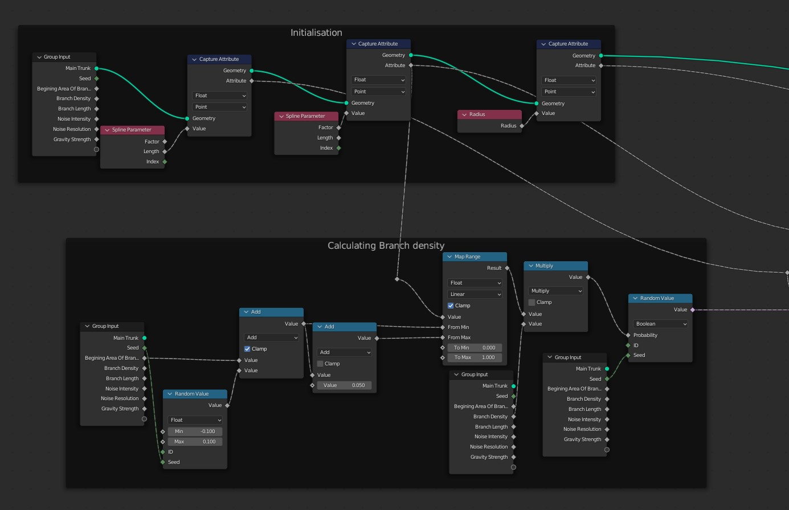

Trees in Geometry Nodes
=================

The repo contains some nodes for generating trees based on splines and curves. It was made using Blender 3.2.0 Alpha. It will probably work with newer versions, but since Geometry Nodes have switched to Fields, you need to be at least on a version that supports fields. 

The example below is a single tree spawned on a surface:

You can also draw the trees yourself using the curve tool! 

You can also see the node in used for this model here: https://skfb.ly/osLOY

Newly added, I also adde a generator for an autom forest, with procedural material for the woods, and randomized colors for the trees: 

Update: newly added, italian cypress trees 

---------
KNOWN ISSUES
--

In order to apply the geometry node and convert it to a real mesh, you cant use instances for the leaves. In my nodes I am using instances since they are faster to render, but you need to Realize the mesh before applying. This behaviour my change in the future.

After applying the geometry nodes, the UVMaps get lost! The uv map is still there as an attribute, it is just not marked as UV Map any more. You can convert this on export to UV map with a [script](https://github.com/nothke/b3d-attribute-converter), use the [built in](https://twitter.com/Nothke/status/1497968184238002181?s=20&t=6z9rORmladSZnvb2EoiQpw) function to convert attributes to certain data, or just use the Attribute node in the shader editor to access the uv. This is a bug and will be fixed in the future.

----------------------
Code Structure
--

The nodes are fairly cleaned up, so it should be easy to follow. The Low Poly Tree group has in it the generation of the main trunk based on a provided curve, branches and leaves.

For the main trunk I figure out the thickness based on how long it has gone along the spline: 

Then I distort the spline based on a noise to give it a more organic look. There are two type of noise I use here, one which keeps the two ends of the spline fixed, the other only the begining fixed. Here is the one that keeps both fixed, the other is a simple variation of this: 

Next is the creation of branches. The whole branch creation is fully procedural based on spline, and the function has a few nodes in it: 

The main idea of the group is to use instances on Points on the trunk spline (or any spline, you can use the Branches node to spawn branches on branches on branches), to spawn a bunch of new splines, which get oriented, scaled and distorted in a way to resemble branches. I wont get in to the detail of distortion and determining branch thickness since we already covered those (only difference with thickness is that you take the thickness of the point the spline was spawned on as begining thickness). 

The first part is capturing all the different curve attributes at the begining to use for calculation. Also branches usually dont pop up everywhere on the trunk, but at a certain height. Here I am using the height of the mother spline to determine at which point branches should start poping up. 

Next is determining the branch alignment. If you have ever noticed, branches only grow in the direction of the light. This mean when we place our spline, we should make sure it is at the very least pointing upward-ish. To achieve this, after randomizing the normal of the curve at the spawn point, I project it on the xy plane. Then doing some cross product I tilt these up by a random value. 

I have written a utility function to convert an eulor to a forward vector. You can create a rotation matrix out of an euler rotation, which if you multiply with the vector X (1, 0, 0), you would get the "*forward*" of that rotation. 

The scale of the curve determines the length of the branch. Here I am randomizing that and also reducing the length of the branches the closer you get to the end of the base curve, since those branches would be the youngest.

Last on that front, I bring down the branches a bit down the further they go from the contact point, to emulate the effect of gravity as the branch grows and time goes by. 

Generating the Leaves is much of the same but instead of curves it is an actual mesh I spawn. This can be cut outs or modelled leaves. The only slight difference is how I determine the alignment there. 

